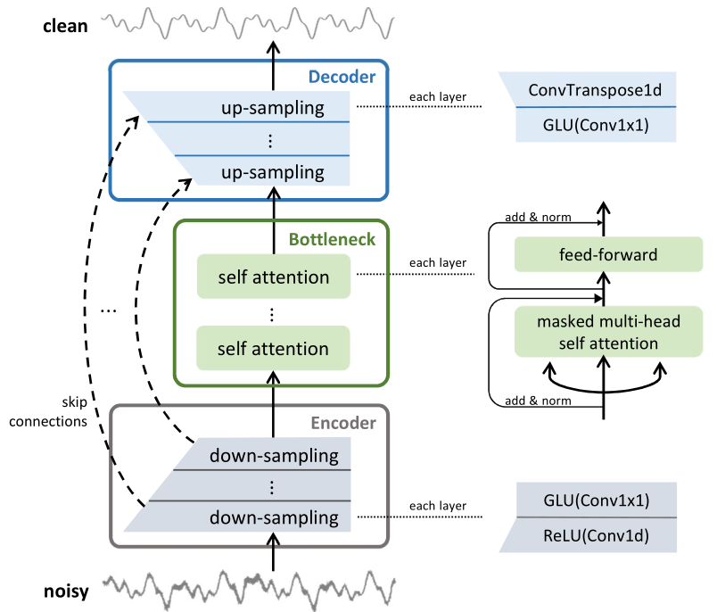

# Pytorch Implementation of CleanUNet

This repo contains official PyTorch implementation of CleanUNet: [Speech Denoising in the Waveform Domain with Self-Attention](https://arxiv.org/abs/2202.07790). CleanUNet is a causal speech denoising
model on the raw waveform. It is based
on an encoder-decoder architecture combined with several
self-attention blocks to refine its bottleneck representations,
which is crucial to obtain good results. The model is optimized
through a set of losses defined over both waveform and multi-resolution spectrograms. The proposed method outperforms
the state-of-the-art models in terms of denoised speech quality
from various objective and subjective evaluation metrics. Sound demos can be found in [This blog](https://nv-adlr.github.io/projects/cleanunet/).



## Datasets

This code is adapted to use any dataset containing clean audios, and during training data augmentation is applied to create a version with noises. Therefore, just create the .csv file and include it in the config.json. As an example, there is a version using the [LJSpeech-1.1](https://keithito.com/LJ-Speech-Dataset/) dataset. The transcripts are not required. The filelists can be found at:

```
filelists/ljs_audio_text_train_filelist.txt
filelists/ljs_audio_text_test_filelist.txt
filelists/ljs_audio_text_val_filelist.txt
```

In `config.json`, just include the path to the csv files:

```
"trainset_config": {
    "data_dir": "../DATASETS/LJSpeech-1.1/wavs",
    "train_metadata": "./filelists/ljs_audio_text_train_filelist.txt",
    "test_metadata": "./filelists/ljs_audio_text_val_filelist.txt",
```

For data augmentation, a basic configuration is already included in `config.json`:

```
        "augmentations": [
            {
                "name": "Mp3Compression",
                "params": {
                    "min_bitrate": 128,
                    "max_bitrate": 192,
                    "backend": "pydub",
                    "p": 0.2
                }
            },
            {
                "name": "AddBackgroundNoise",
                "params": {
                    "sounds_path": "./noises_path/",
                    "min_snr_in_db": 15.0,
                    "max_snr_in_db": 30.0,
                    "p": 0.2
                }
            },  
            {
                "name": "AddGaussianSNR",
                "params": {
                    "min_snr_in_db": 15,
                    "max_snr_in_db": 30,
                    "p": 0.2
                }
            },
            {
                "name": "LowPassFilter",
                "params": {
                    "min_cutoff_freq": 4000,
                    "max_cutoff_freq": 7000,
                    "p": 0.2
                }
            },
            {
                "name": "HighPassFilter",
                "params": {
                    "min_cutoff_freq": 400,
                    "max_cutoff_freq": 2000,
                    "p": 0.2
                }
            }
        ]  
```

## Training

The ```$EXP``` variable can be any config name in ```./configs/```, such as ```DNS-large-full``` and ```DNS-large-high```. The default experiment path is ```./exp```; it can be changed by modifying ```train_config[log[directory]]``` in the config files. ```trainset_config[root]``` needs to be set as the root path of the dataset. Then, the training code is

```python3 distributed.py -c configs/${EXP}.json```

We use 8 GPUs for training. The global batch size is 64 and we train the models for 250K iterations. Note that, this is different from the training setup in our paper i.e., 1M iterations with a batch size of 16. We find negligible difference in terms of objective and subjective evaluation, but the current setup is faster.

**Pre-trained** models for denoising are provided in ```./exp/${EXP}/checkpoint/pretrained.pkl``` (each one has size ~177Mb; use ```git lfs``` to download). Note that these models are not trained to remove reverb. 

## Fine Tuning

To perform finetuning, you can include the path to the checkpoint in config.json:

```
"checkpoint_path": "exp/DNS-large-full/checkpoint/pretrained.pkl",
```

and run the training:

```python train.py -c configs/config.json```

## Denoising

We perform denoising on the DNS no-reverb test dataset. The output path is ```gen_config[output_directory]```, which is ```./exp``` by default. The denoising code is

```python denoise.py -c configs/${EXP}.json --ckpt_iter ${ITERATION}```

For example, if you want to use pre-trained models to denoise, run:

```python denoise.py -c configs/DNS-large-high.json --ckpt_iter pretrained```

1 GPU is used for denoising.

## Evaluation

The following evaluation code generates [PESQ](https://www.itu.int/rec/T-REC-P.862) and [STOI](https://ceestaal.nl/code/) scores. More evaluation metrics can be found in the [SEGAN (PyTorch)](https://github.com/santi-pdp/segan_pytorch) repo.

```python python_eval.py -d dns -e ${PATH_TO_DENOISED_SPEECH} -t ${PATH_TO_TESTSET_PATH} >> eval.log```

1 GPU is used for evaluation.

## Requirements

To synthesize [Microsoft DNS 2020](https://arxiv.org/ftp/arxiv/papers/2005/2005.13981.pdf) training data, you need [these dependencies](https://github.com/microsoft/DNS-Challenge/blob/interspeech2020/master/requirements.txt). If you just want to evaluate our pre-trained models on the test data, you may jump this.

Our code is tested on 8 NVIDIA V100 GPUs. You need to install very standard dependencies: ```numpy``` and ```scipy``` for scientific computing, ```torch, torchvision, torchaudio``` for deep learning and data loading, ```pesq, pystoi``` for audio evaluation, and ```tqdm``` for visualization.

## References

The code structure and distributed training are adapted from [WaveGlow (PyTorch)](https://github.com/NVIDIA/waveglow) (BSD-3-Clause license). The ```stft_loss.py``` is adapted from [ParallelWaveGAN (PyTorch)](https://github.com/kan-bayashi/ParallelWaveGAN) (MIT license). The self-attention blocks in ```network.py``` is adapted from [Attention is all you need (PyTorch)](https://github.com/jadore801120/attention-is-all-you-need-pytorch) (MIT license), which borrows from [OpenNMT-py](https://github.com/OpenNMT/OpenNMT-py) (MIT license). The learning rate scheduler in ```util.py``` is adapted from [VQVAE2 (PyTorch)](https://github.com/rosinality/vq-vae-2-pytorch) (MIT license). Some utility functions are borrowed from [DiffWave (PyTorch)](https://github.com/philsyn/DiffWave-Vocoder) (MIT license) and [WaveGlow (PyTorch)](https://github.com/NVIDIA/waveglow) (BSD-3-Clause license).

For more evaluation methods, we refer readers to look at [SEGAN (PyTorch)](https://github.com/santi-pdp/segan_pytorch/blob/master/segan/utils.py) (MIT license). For more data augmentation methods, we refer readers to look at [FAIR-denoiser](https://github.com/facebookresearch/denoiser/blob/main/denoiser/augment.py) (CC-BY-NC 4.0 license). 

## Citation

```
@inproceedings{kong2022speech,
  title={Speech Denoising in the Waveform Domain with Self-Attention},
  author={Kong, Zhifeng and Ping, Wei and Dantrey, Ambrish and Catanzaro, Bryan},
  booktitle={ICASSP 2022-2022 IEEE International Conference on Acoustics, Speech and Signal Processing (ICASSP)},
  pages={7867--7871},
  year={2022},
  organization={IEEE}
}
```
